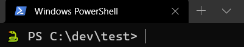
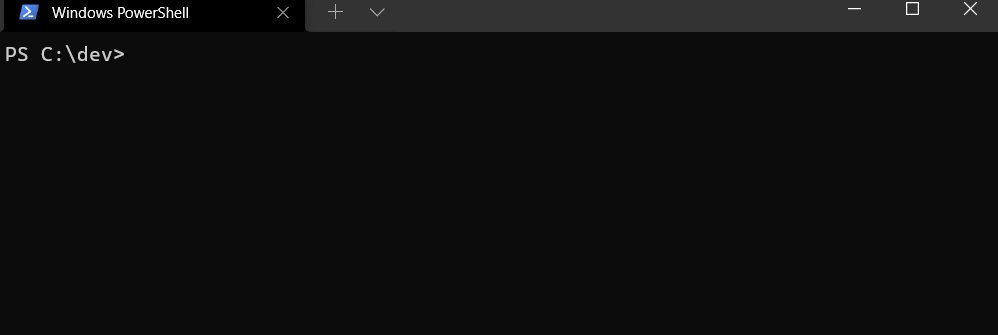

[](https://ci.appveyor.com/project/82phil/ps-devenv)

# Introduction

This tool provides PowerShell functions that automate the workflow of setting
up and using a development environment.

- Create templates to perform operations like setting environment variables, IDE
workspace settings, etc.
- Create aliases specific to the project, handling routine operations
- Easily switch between development environments

The examples provided are geared to my work but will provide enough for you
to implement your own.

# Use Case

## Set up an environment

Instead of building a Python virtual environment and running pip commands to
install packages, this tool handles it in one command:

1. Clone down a repository
2. Launch Powershell and type `New-Code Python`. Give it a minute or two ☕


The script automates the workflow of creating a Python virtual environment,
installing the requirements file via pip, setting up environmental variables,
and providing additional tools set up as aliases.

[Python Dev Env Template README](./DevEnv/.pcode_python/.pcode/README.md)

## Use an existing environment

Now that you have set up an environment, you can easily come back to it later on.

1. Navigate to the project directory
2. Type `Enter-Code` and your environment is setup and ready to use
3. Type `Exit-Code` to tear down the environment, or simply leave the project
directory.

> Keep reading for information on how to automatically perform these
> operations simply by changing in and out of the project directory

## Change the Project prompt

The `.settings.json` file in `.pcode` that allows you to change the prompt of
the project. UTF8 encoding is supported, use Windows Terminal for characters
such as emojis to work.

```json
{
    "version": 1.0,
    "prompt": {
        "Object": "🐍 ",
        "BackgroundColor": null,
        "ForegroundColor": null
    }
}
```




# Installation 

This module is available from the PowerShell Gallery, perform the following:

```
Install-Module DevEnv -Scope CurrentUser
```

## Setup Project Directory Tracking

Automatically enter your development environment when entering the
project directory.



Run the following in PowerShell to append the project detection code to the end of the profile.

```powershell
if (-not (test-path $profile)) {
    new-item -path $profile -itemtype file -force
}
Add-Content $profile @'
### DevEnv detect project directories ###
function global:_PWSH_ORIG_PROMPT {
    ""
}
$function:_PSWH_ORIG_PROMPT = $function:prompt
function global:prompt {
  if (Enter-Code -auto_entry) {
    return & $function:_DEVENV_PROMPT
  } else {
    return & $function:_PSWH_ORIG_PROMPT
  }
}
######
'@
```

# Create your templates

Use the `Set-Code` command to create your environment templates. If there
is an existing template under DevEnv under that name, it will be copied to
your template.

```
Set-Code python
explorer.exe (Get-Code python).FullName
```

# Environment File Structure

DevEnv calls scripts in the `.pcode` directory. Files prefixed with double
dots are executed when a function is called (ex: `Enter-Code`). Any `*.ps1`
files are set up as aliases, with the same name as the file, on project
entrance. Other file types and sub-directories are not used by DevEnv.

```
├───.pcode    - DevEnv executes scripts under this directory
│   │   ..enter.ps1   - Entrant Script (Enter-Code)
│   │   ..exit.ps1    - Exit Script (Exit-Code)
│   │   ..init.ps1    - Initialization Script (New-Code)
│   │   clean.ps1     - Aliases
│   │   idle.ps1      *
│   │   lint.ps1      *
│   │   README.md
│   └───helpers
│           build_env.ps1
│           info.py
│
└───.vscode
        settings.json

```

You can add additional files, which are copied over when creating a new
developer environment (`New-Code`), such as `.gitignore`. In the Python
template above, a `.vscode` directory provides additional for [Visual Studio
Code](https://code.visualstudio.com/) in the development environment.
