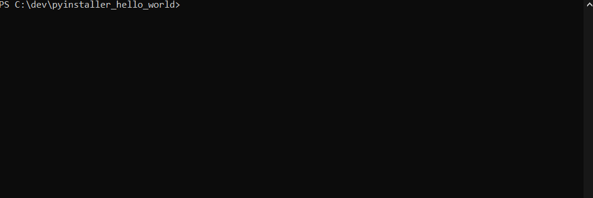

# Introduction

Provides PowerShell aliases to automated the setup of a development environment.
The examples provided are tuned to my workflow but hopefully
provide enough to allow you to implement your own. 

# Use Case

Instead of manually building (or rebuilding) a Python virtual environment
and running pip commands to install packages this is meant to do it all in one
command, like so:

1. Clone down repository
2. Launch Powershell and type `New-Code Python`, grab a cup of coffee



The script automates the workflow of creating the Python virtualenv and
installing packages via pip. A moment or two later everything should be ready.

[More Information](./.pcode_python/.pcode/README.md)

# Installation 

## Module installation

The PowerShell module can be installed either at a location where it can
be auto-imported (`$env:PSmodulePath`) or imported manually from any location.

## Adding to your existing PowerShell Profile

It can be helpful to automatically enter your development environment when
starting a shell in your project directory. To do this you will need to update
your PowerShell Profile.

### Profile?

If you don't know if you already have a profile in Powershell, open powershell
and execute the following command

```powershell
test-path $profile
```

If the profile exists, the response is True; otherwise, it is False. If it does
exists, skip to the existing profile section.

### Create a New Profile

To create a Windows PowerShell profile file, type:

```powershell
new-item -path $profile -itemtype file -force
```

### Modify the Profile

Add the following to the end of the Profile
```
Enter-Code
```

Now your session will be automatically setup when you launch a PowerShell
session in your project directory.

# Structure

Under each environment is a `.pcode` folder. Under this are two scripts, `.init.ps1` and
`autorun.ps1`. The init script is called when the environment is first built. The autorun
script is called if the environment already exists.

```
└───.pcode_python
    ├───.pcode
    │       .init.ps1
    │       autorun.ps1
    │       build_env.ps1
    │       clean_env.ps1
    │       README.md
    │
    └───.vscode
            settings.json
```

Initially all contents are copied over from the directory where the module is.
Take advantage of this to also bring over files like settings for your IDE, or a
`.gitignore` file.
